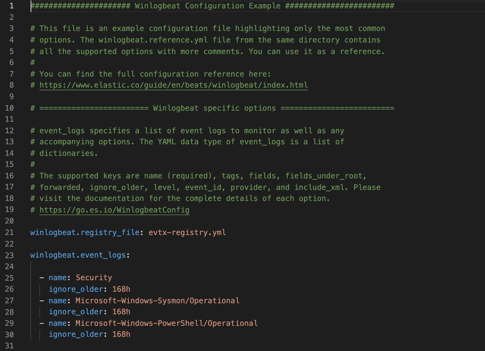
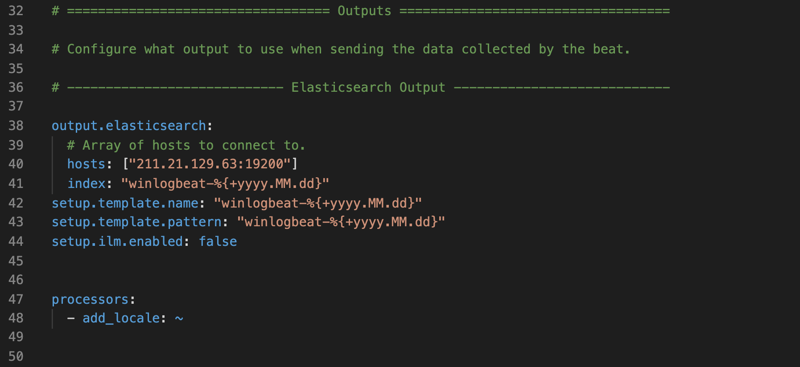
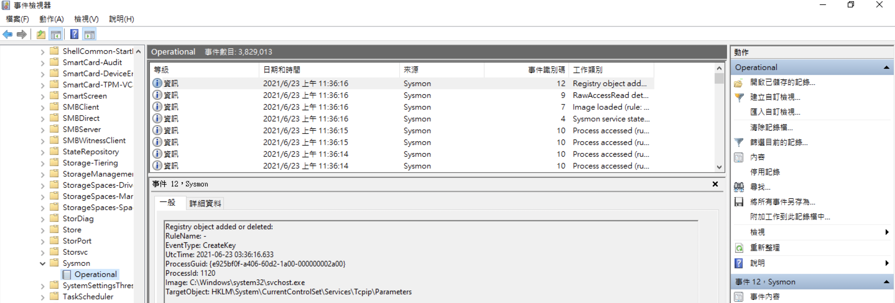
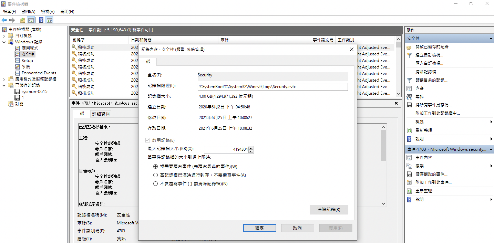

# Winlogbeat

Winlogbeat is a tool that can help us to upload window logs to Elasticsearch. It's developed by Elastic company and the document can refer to [here](https://www.elastic.co/guide/en/beats/winlogbeat/current/index.html). The basic operation steps will show below.

1. Download the [winlogbeat](https://www.elastic.co/downloads/beats/winlogbeat) program.
2. Set your parameter in winlogbeat.yml. For example, you can add specified logs in winlogbeat.yml and then they will be sent to your Elasticsearch with specified index name.
3. Install winlogbeat in your cmd with `{YOUR_FOLDER_PATH}\winlogbeat.exe -e -c winlogbeat.yml`.
4. After the command is finished, your will see the winlogbeat is working in Task Manager (Ctrl+Alt+Del).

## winlogbeat.yml

 
 

This diagram is an example for the content of winlogbeat.yml.

- `winlogneat.registry_file`: The record for successful transmission information.
- `winlogbeat.event_logs`: The type of Logs which we wanted to upload. Here we can see there are three kinds of logs(Security, Sysmon, and PowerShell).
- `output.elasticsearch`: The output information of the elasticsearch, such as, host, port, and index.

## Windows event viewer

Above mentioned logs were stored in this path `C:\Windows\System322\winevt\Logs`. We can open these files with event viewer and observe their content. For example, we click 'Microsoft-Windows-Sysmon%4Operation.evtx' and show the information in event viewer which is like below. 

 

### Filter Function

Furthermore, we can apply the filter function to helpe us to get specified logs, and then save to another .evtx file. e.g., We only want to analyze logs in 2021-06-24.

### Clear Log

If .evtx file is too larger to sotre in your PC, then you can manually clear it. Click the file and select the `Clear Log`, and then choose `Clear` or `Save and Clear`.

### Setting

We can set the count of logs in `windows Record > Security > Content`. There are three optional actions when the log counts is close to upper limit.

 

## Reference

[1] [Elastic](https://www.elastic.co/beats/winlogbeat)

[2] [Elastic - Configure Winlogbeat](https://www.elastic.co/guide/en/beats/winlogbeat/current/configuration-winlogbeat-options.html)

[3] [3-2.監控工具之三:Elastic-winlogbeat事件稽核](https://ithelp.ithome.com.tw/articles/10191552)

[4] [Clear an Event Log](https://docs.microsoft.com/en-us/previous-versions/windows/it-pro/windows-server-2008-R2-and-2008/cc722318(v=ws.11)?redirectedfrom=MSDN)

[5] [該系統的安全日誌已滿，只允許管理員登錄以解決問題](https://www.twblogs.net/a/5beb27d02b717720b51ee69c)
